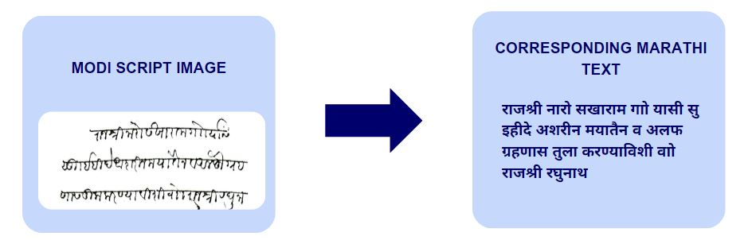
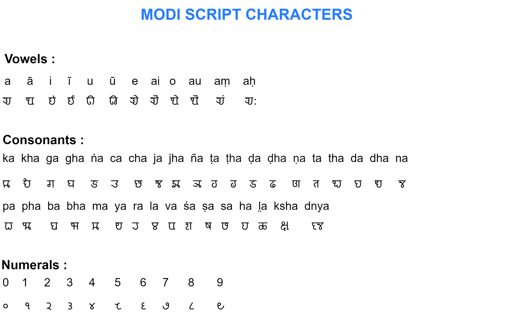
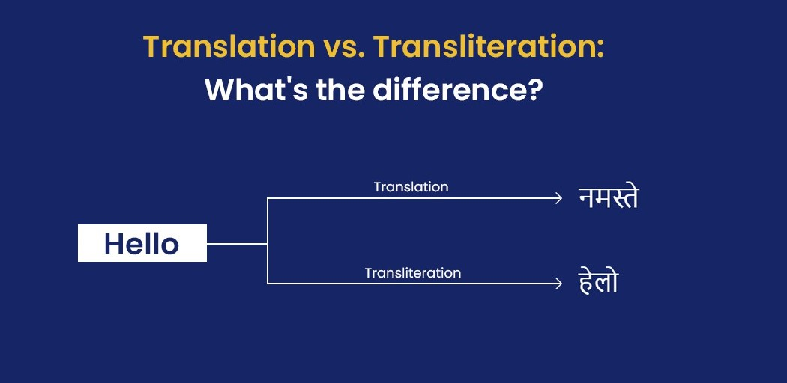

# Modi_Script_Transliterator
Modi Script Transliterator tool which instantly translates text in a Modi Script image to its equivalent text in Devanagari. The task of direct conversion is achieved by using the novel concept of Transliteration through Image Captioning.

---
### About Modi Script
Modi Script is a script which was used to write Marathi during medieval India. During the Maratha rule, it served as the official script. The Modi script was not only restricted to the state of Maharashtra. Other parts of India also saw widespread use of the script.
It is believed that a minister named “Hemadpant”, during the reign of Ramadeva created this script
during the 12th century. 

Modi can be classified into 5 types- 
* Adyakalin Modi (of 12th century)
* Yadavkalin Modi (of 13th century)
* Bahmanikalin Modi (of 14th– 16th century)
* Shivkalin Modi (17th century)
* Peshwekalin Modi (18th-19th century)

Modi script was designed to achieve faster writing
which led to its cursive and highly angular nature with no spaces between
two words. Hence, there is no clear distinction between start and end of a
word. This makes it substantially different from today’s Devanagari script.
Modi Script consists of 46 letters– among them, 36 are consonants and 10
are vowels. There are some letters and consonants that seem to look quite
alike. One of the Peculiar features of this script is the “Shirorekha” which is
a long horizontal line drawn before starting on the new line. Also, very few
punctuation marks are observed in the historical texts of Modi script. The
characters of Modi script are shown in Figure below.

### Transliteration v/s Translation
To be concise,
Translation is LANGUAGE to LANGUAGE
Transliteration is SCRIPT TO SCRIPT

### Introducing MODI-2043 Dataset
The MODI-2043 dataset contains 2043 images of Modi script text along with their corresponding Devanagari transliterations in text. This dataset consists of letters of _Peshawekaalin_ and _Shivakaalin_ Modi Script. It also includes a variety of Modi writing styles.
<!-- You can find the dataset here -  -->

<!-- ### Methodology

##### Classical CNN-RNN Approach
Using Merging Architecture, textuals captions are generated for an input image.
##### Transformer based Approach

### Results
| Model                   | BLEU1 | BLEU2 |
|-------------------------|-------|-------|
| VGG16 + Transformer     |0.006731|0.001247|
| EfficientNetB0 + Transformer |0.088344|0.017591|
| InceptionV3 + Transformer |0.109254|0.020413|
| ResNet50 + Transformer  |0.011143|0.001680|

It is observed that the InceptionV3 model gave better results as compared to the ResNet50 and EfficientNet models.
 -->

